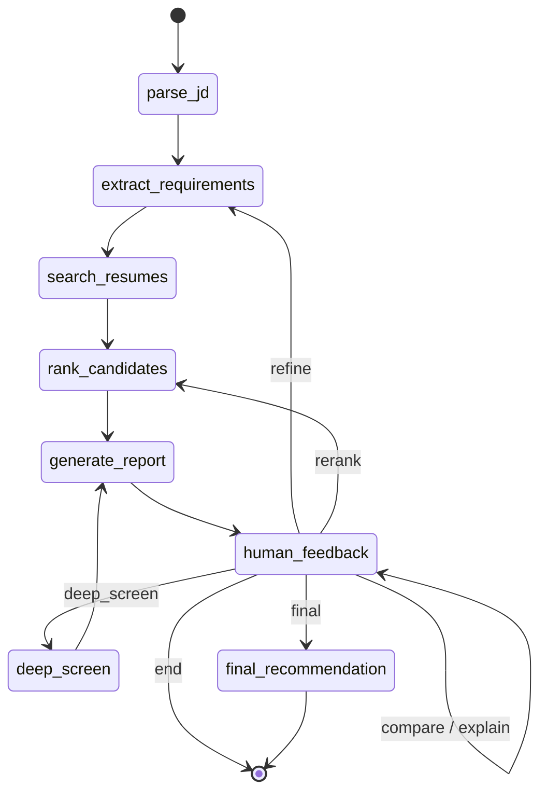

# Guided Walkthrough

A complete screening session, start to finish. Each step shows what to
type, what the agent does internally, and what to expect back.

## Prerequisites

- Virtual environment active, `ANTHROPIC_API_KEY` set (see [README setup](README.md#setup)).
- `python generate_sample_data.py` and `python resume_rag.py` already run.
  The corpus is 100 resumes across 12 job families.

## The state machine



The compiled graph interrupts before `human_feedback` on every entry, so
the conversation resumes from a checkpoint rather than restarting. That's
what makes it multi-turn.

## Step 1 — Initial screen

**Input:** `Screen candidates against data/job_descriptions/senior_ml_engineer.txt`

**Nodes executed:** `parse_jd` → `extract_requirements` → `search_resumes`
→ `rank_candidates` → `generate_report`

**What happens:** `parse_jd` reads the file via `fs_tools`. `extract_requirements`
calls Claude with a forced tool call to split must-have from nice-to-have.
`search_resumes` embeds the JD and queries ChromaDB, over-fetching chunks
(5x the requested candidate count) then aggregating by candidate.
`rank_candidates` applies hybrid scoring (0.6 semantic + 0.4 keyword) and
drops anyone below the min-years bar or missing more than half the
must-haves.

**Expect:** a shortlist of up to 10 from the 100-resume corpus, with
per-candidate scores, matched skills, and gaps.

## Step 2 — Refine requirements mid-conversation

**Input:** `Make Kubernetes a must-have`

**Route taken:** `refine` → back to `extract_requirements`

**What happens:** the router classifies this as a requirements change, so
the graph re-enters `extract_requirements`, updates the structured
requirements object, then re-runs search and ranking. Note explicitly: the
job description file is never modified — what changes is the extracted
requirements in agent state.

**Expect:** a new shortlist plus a narrated delta — who dropped off, who
moved up, and why.

## Step 3 — Compare candidates

**Input:** `Compare the top 3 side by side`

**Route taken:** `compare` → answered inline, loops back to `human_feedback`

**What happens:** no dedicated downstream node exists for comparison, so
`human_feedback` calls `compare_candidates` and produces the answer
directly before returning to the pause point. The shortlist is untouched.

**Expect:** a shared-attribute table across the three plus a short
narrative on how they differ.

## Step 4 — Explain a ranking

**Input:** `Why did Amara Castellano rank higher than Elena Whitfield?`

**Route taken:** `explain` → answered inline

**What happens:** resolves both names against the current shortlist and
explains using their actual scores, matched skills, and retrieved chunks.

**Expect:** a grounded comparison citing real numbers, not invented
qualifications.

## Step 5 — Round 2, deep analysis

**Input:** `Do a deeper analysis on the top candidates`

**Route taken:** `deep_screen` → `generate_report`

**What happens:** `round_number` advances to 2. For each shortlisted
candidate, pulls all their chunks and generates a strengths/gaps breakdown
plus targeted interview questions via `generate_interview_questions`.

**Expect:** per-candidate detail well beyond the round 1 summary.

## Step 6 — Round 3, final recommendation

**Input:** `Give me a final hire recommendation`

**Route taken:** `final` → `final_recommendation` → `END`

**What happens:** `round_number` advances to 3. Produces hire / no-hire /
maybe per candidate with justification grounded in retrieved content.

**Expect:** a decision per candidate, not just a score.

## Why rounds are manual

Round 2 (deep analysis) and round 3 (final recommendation) are expensive
Claude-backed operations across the whole shortlist. Advancing
automatically would burn tokens on analysis the user may not want yet, so
progression happens on instruction.

## Running the tests

```bash
python test_scenarios.py
```

1. **Initial screening** — requirements extracted correctly, shortlist of
   up to 10, all meeting the min-years bar.
2. **Mid-conversation refinement** — adding a must-have skill updates the
   requirements and the agent narrates what changed in the ranking.
3. **Head-to-head comparison** — "compare the top 3" covers all 3 with
   shared attributes.
4. **Ranking explanation** — "why did X rank above Y" references real
   scores and skills, not invented ones.
5. **Full multi-round flow** — round 1 → round 2 → round 3, asserting
   `round_number` advances and each round's output has the expected shape.
6. **Natural language filter** — "candidates with React and 3+ years" is
   captured as a requirement and the shortlist respects it.
