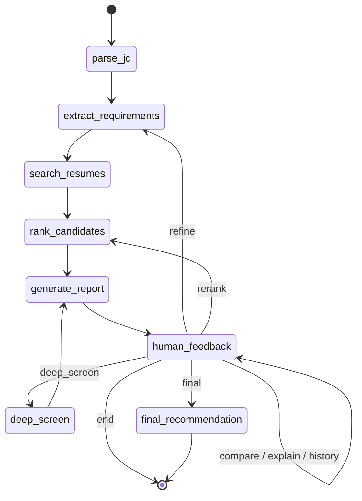

# Agentic Profile Matching

A LangGraph agent that screens resumes against job descriptions through a
multi-round, conversational workflow: an initial screen, a deep analysis of
the shortlist, and a final hire/no-hire/maybe recommendation — all steerable
mid-conversation ("make Kubernetes a must-have", "compare the top 3").

## Guided walkthrough

See [`DEMO.md`](DEMO.md) for a step-by-step walkthrough of a real screening
session — what to type, what the agent does internally, and what to expect
back at each turn.

## What each milestone contributed

- **Milestone 1** (`fs_tools.py`) — filesystem tools (read/list/write/search)
  for `.txt`/`.pdf`/`.docx` resumes. Never raises; every function returns a
  status dict so a single bad file can't break a pipeline run.
- **Milestone 2** (`resume_rag.py`, `job_matcher.py`) — section-aware resume
  chunking and embedding into ChromaDB, plus hybrid semantic + keyword
  matching against a job description with must-have filtering.
- **Milestone 3** — wraps Milestones 1-2 as agent tools (`agent_tools.py`),
  adds three new LLM-backed tools (requirement extraction, candidate
  comparison, interview question generation) running on OpenRouter, and
  wires everything into a LangGraph state machine (`matching_agent.py`)
  exposed through a Streamlit chat UI (`app.py`) and a CLI (`cli.py`).
- **Milestone 4** (this one) — moves the filesystem tools behind a real MCP
  server (`filesystem_mcp_server.py`) speaking JSON-RPC 2.0, adds a second
  MCP server backed by SQLite for cross-session screening decisions
  (`notes_mcp_server.py`), and refactors the agent to discover and call
  both at runtime through an MCP client (`mcp_client.py`) instead of
  importing `fs_tools` directly. See [MCP](#mcp-milestone-4) below and
  [`docs/mcp_architecture.md`](docs/mcp_architecture.md) for the full
  picture.

## Architecture

### State machine

See [`docs/state_machine.md`](docs/state_machine.md) for the full diagram,
the `AgentState` field table, and the node/tool table.



The compiled graph interrupts before `human_feedback` on every entry, so a
caller can inject the user's next message into state before the routing
node reads it — that's what makes a single checkpointed thread usable across
many chat turns instead of one shot start-to-end.

## Setup

```bash
python3.11 -m venv .venv
source .venv/bin/activate
pip install -r requirements.txt
cp .env.example .env   # fill in OPENROUTER_API_KEY
```

No separate setup step for MCP — `mcp_config.json` ships with working
defaults (see [MCP](#mcp-milestone-4) below), and `matching_agent.py`
launches both MCP servers itself as subprocesses on first use.

Runs on [OpenRouter](https://openrouter.ai/) rather than a direct model
provider, so it can run on free models — `MODEL` defaults to
`openrouter/free`, which auto-selects a capable free model rather than
pinning to one that may rotate out. OpenRouter's free tier is rate-limited
(20 requests/minute, 50-1000/day depending on account credit); API calls
here retry on HTTP 429 with backoff, and the LLM-backed extraction/tooling
falls back to regex-based heuristics if a call fails or a free model
returns malformed tool-call output.

## Generate sample data

```bash
python generate_sample_data.py
```

Produces 100 resumes (mixed `.txt`/`.docx`/`.pdf`) across 12 job families in
`data/resumes/`, and 6 job descriptions in `data/job_descriptions/`.
Deterministic (seeded) — the first 5 candidates are fixed "anchor" profiles
that `test_scenarios.py` asserts against by name.

## Ingest

```bash
python resume_rag.py
```

Chunks and embeds every resume in `data/resumes/` into a persistent ChromaDB
collection at `./chroma_db`. Re-running is idempotent (existing chunks for a
resume are deleted before new ones are added).

## Run

```bash
streamlit run app.py     # chat UI
python cli.py             # terminal alternative
```

Both share all agent logic via `matching_agent.run_turn` — neither
duplicates graph-driving code.

## MCP (Milestone 4)

The agent no longer imports `fs_tools.py` directly. Filesystem access goes
through `filesystem_mcp_server.py` — a standalone MCP server speaking
JSON-RPC 2.0 — via `mcp_client.py`. A second server, `notes_mcp_server.py`,
persists round-3 screening decisions to SQLite (`data/notes.db`) so
"have we screened Elena before?" works across sessions. Full diagrams and
protocol details: [`docs/mcp_architecture.md`](docs/mcp_architecture.md).

### Run a server standalone, for inspection

```bash
python filesystem_mcp_server.py                       # stdio (what the agent uses)
python filesystem_mcp_server.py --transport http --port 8765   # streamable HTTP, for curl
```

With the HTTP transport running, from another terminal:

```bash
curl -s -X POST http://127.0.0.1:8765/mcp/ \
  -H "Content-Type: application/json" -H "Accept: application/json, text/event-stream" \
  -d '{"jsonrpc":"2.0","id":1,"method":"initialize","params":{"protocolVersion":"2025-06-18","capabilities":{},"clientInfo":{"name":"curl-demo","version":"1.0"}}}'

curl -s -X POST http://127.0.0.1:8765/mcp/ \
  -H "Content-Type: application/json" -H "Accept: application/json, text/event-stream" \
  -d '{"jsonrpc":"2.0","id":2,"method":"tools/list","params":{}}'
```

(Note the trailing slash on `/mcp/` — Starlette 307-redirects the
no-slash form, which most JSON-RPC clients won't follow automatically.)
`notes_mcp_server.py` supports the same `--transport http` flag on a
different default port. Either server also works with the
[MCP inspector](https://modelcontextprotocol.io/docs/tools/inspector) over
stdio.

To see what the client discovers from both servers without running the
full agent:

```bash
python mcp_client.py
```

### How the agent discovers tools

`mcp_client.MCPClientManager` reads `mcp_config.json`'s `servers` section,
launches each configured server, and calls `tools/list` (and
`resources/list`, for the filesystem server) — nothing is hardcoded.
`matching_agent.py`'s graph nodes call `manager.call_tool("read_file", ...)`
by name; if a future server added a differently-named or additional tool,
no agent code would need to change to make it discoverable, only to make
use of it.

### Config file and the security boundary

`mcp_config.json` controls both servers (env-var overrides documented in
its consumers' docstrings, e.g. `MCP_ALLOWED_DIRECTORIES`,
`MCP_MAX_FILE_SIZE_BYTES`, `MCP_NOTES_DATABASE_PATH`):

```json
{
  "allowed_directories": ["data/resumes", "data/job_descriptions"],
  "max_file_size_bytes": 5000000,
  "batch_concurrency": 5,
  "watch_debounce_ms": 500,
  "resume_directory": "data/resumes",
  "notes_database_path": "data/notes.db",
  "servers": { "filesystem": {...}, "notes": {...} }
}
```

`allowed_directories` is a hard security boundary, not a suggestion: every
path any filesystem tool receives is resolved with `os.path.realpath`
(collapsing `../` and symlinks) and rejected unless it's a descendant of
one of these directories, before any file is opened. This is what the
original `fs_tools.py` never enforced when called directly — an absolute
path or a `../` escape went straight to `open()`.

## Tests

```bash
python test_scenarios.py       # Milestones 1-3, live agent, needs OPENROUTER_API_KEY
python test_mcp_scenarios.py   # Milestone 4: protocol tests (free) + 2 integration tests (1 LLM call)
python test_mcp_scenarios.py --protocol-only   # skip the integration tests entirely
```

Six end-to-end conversation flows against the live agent (requires
`OPENROUTER_API_KEY` and an ingested corpus):

1. **Initial screening** — requirements extracted correctly, shortlist of
   (up to) 10, all meeting the min-years bar.
2. **Mid-conversation refinement** — adding a must-have skill updates the
   requirements, re-runs search/ranking, and the agent narrates what
   changed in the ranking.
3. **Head-to-head comparison** — "compare the top 3" covers all 3 with
   shared attributes.
4. **Ranking explanation** — "why did X rank above Y" references real
   scores and skills, not invented ones.
5. **Full multi-round flow** — round 1 → round 2 (deep analysis) → round 3
   (final recommendation), asserting `round_number` advances and each
   round's output has the expected shape.
6. **Natural language filter** — "candidates with React and 3+ years"
   is captured as a requirement and the shortlist respects it.

## Design decisions

- **LangGraph over a plain tool loop.** The screening workflow has real
  state (which round, what requirements, what shortlist) and real
  transitions (refine vs. rerank vs. advance a round) that benefit from
  being explicit and inspectable rather than emergent from a ReAct loop's
  tool-calling history. A `MemorySaver` checkpoint also gives conversation
  persistence across turns for free.
- **`human_feedback` routes via a classifier, not keyword matching.**
  Refinement instructions arrive as free text ("make Kubernetes a
  must-have", "drop the years requirement to 2", "actually let's see the
  top 3 side by side") with no reliable keyword to switch on. A forced
  tool call classifies intent into one of seven routes and — for
  `compare`/`explain`, which have no dedicated downstream node — also
  produces the grounded answer inline.
- **Rounds advance on instruction, not automatically.** Round 2 (deep
  analysis) and round 3 (final recommendation) are expensive LLM-backed
  operations over the whole shortlist; running them automatically after
  round 1 would burn tokens/quota on interactions the user may not want yet.

## Known limitations

- The `human_feedback` routing classifier's accuracy depends on the
  underlying free model's tool-call classification, which is less reliable
  than a frontier model; ambiguous phrasing can misroute a turn (falls back
  to `end` on any failure or malformed response, never crashes the graph).
- `compare`/`explain` resolve "the top N" or named candidates against the
  *current* shortlist only — they can't reference a candidate who has since
  dropped off after a refinement.
- Metadata extraction (skills/years/education) depends on the LLM when
  available; the regex fallback is deliberately conservative and may miss
  skills or years phrased unusually.
- OpenRouter's free-tier rate limits (20 req/min, 50-1000/day) mean heavy
  use (e.g. re-ingesting the full resume corpus, or running the whole test
  suite repeatedly) can exhaust the daily quota.
- No conversation persistence across process restarts — `MemorySaver`
  checkpoints live in memory, so a conversation thread doesn't survive an
  app restart. (Round-3 screening *decisions* are the exception: those are
  persisted to `data/notes.db` via the notes MCP server and do survive a
  restart — see [MCP](#mcp-milestone-4).)
- Each MCP tool call opens a fresh subprocess (a `langchain-mcp-adapters`
  0.3.x behavior, not a design choice made here — see
  [`docs/mcp_architecture.md`](docs/mcp_architecture.md)), adding a few
  hundred ms of process-startup latency per filesystem/notes call. Fine for
  a demo-scale agent; the first thing to change for a latency-sensitive
  deployment.

## Demo video

Written walkthrough: [`DEMO.md`](DEMO.md). Video: TODO — link here.
