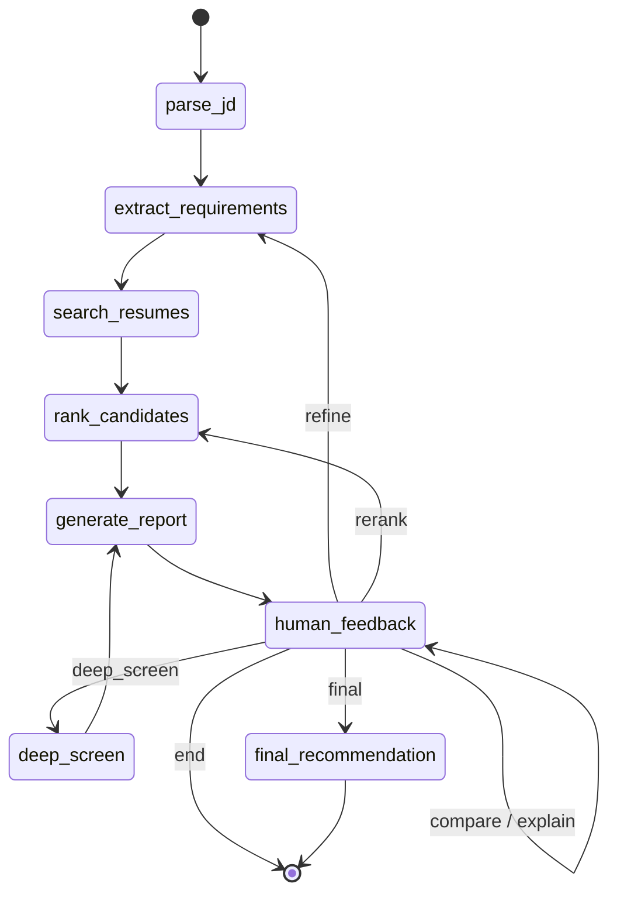

# Agentic Profile Matching

A LangGraph agent that screens resumes against job descriptions through a
multi-round, conversational workflow: an initial screen, a deep analysis of
the shortlist, and a final hire/no-hire/maybe recommendation — all steerable
mid-conversation ("make Kubernetes a must-have", "compare the top 3").

## Guided walkthrough

See [`DEMO.md`](DEMO.md) for a step-by-step walkthrough of a real screening
session — what to type, what the agent does internally, and what to expect
back at each turn.

## What each milestone contributed

- **Milestone 1** (`fs_tools.py`) — filesystem tools (read/list/write/search)
  for `.txt`/`.pdf`/`.docx` resumes. Never raises; every function returns a
  status dict so a single bad file can't break a pipeline run.
- **Milestone 2** (`resume_rag.py`, `job_matcher.py`) — section-aware resume
  chunking and embedding into ChromaDB, plus hybrid semantic + keyword
  matching against a job description with must-have filtering.
- **Milestone 3** (this one) — wraps Milestones 1-2 as agent tools
  (`agent_tools.py`), adds three new Claude-backed tools (requirement
  extraction, candidate comparison, interview question generation), and
  wires everything into a LangGraph state machine (`matching_agent.py`)
  exposed through a Streamlit chat UI (`app.py`) and a CLI (`cli.py`).

## Architecture

### State machine

See [`docs/state_machine.md`](docs/state_machine.md) for the full diagram,
the `AgentState` field table, and the node/tool table.



The compiled graph interrupts before `human_feedback` on every entry, so a
caller can inject the user's next message into state before the routing
node reads it — that's what makes a single checkpointed thread usable across
many chat turns instead of one shot start-to-end.

## Setup

```bash
python3.11 -m venv .venv
source .venv/bin/activate
pip install -r requirements.txt
cp .env.example .env   # fill in ANTHROPIC_API_KEY
```

## Generate sample data

```bash
python generate_sample_data.py
```

Produces 100 resumes (mixed `.txt`/`.docx`/`.pdf`) across 12 job families in
`data/resumes/`, and 6 job descriptions in `data/job_descriptions/`.
Deterministic (seeded) — the first 5 candidates are fixed "anchor" profiles
that `test_scenarios.py` asserts against by name.

## Ingest

```bash
python resume_rag.py
```

Chunks and embeds every resume in `data/resumes/` into a persistent ChromaDB
collection at `./chroma_db`. Re-running is idempotent (existing chunks for a
resume are deleted before new ones are added).

## Run

```bash
streamlit run app.py     # chat UI
python cli.py             # terminal alternative
```

Both share all agent logic via `matching_agent.run_turn` — neither
duplicates graph-driving code.

## Tests

```bash
python test_scenarios.py
```

Six end-to-end conversation flows against the live agent (requires
`ANTHROPIC_API_KEY` and an ingested corpus):

1. **Initial screening** — requirements extracted correctly, shortlist of
   (up to) 10, all meeting the min-years bar.
2. **Mid-conversation refinement** — adding a must-have skill updates the
   requirements, re-runs search/ranking, and the agent narrates what
   changed in the ranking.
3. **Head-to-head comparison** — "compare the top 3" covers all 3 with
   shared attributes.
4. **Ranking explanation** — "why did X rank above Y" references real
   scores and skills, not invented ones.
5. **Full multi-round flow** — round 1 → round 2 (deep analysis) → round 3
   (final recommendation), asserting `round_number` advances and each
   round's output has the expected shape.
6. **Natural language filter** — "candidates with React and 3+ years"
   is captured as a requirement and the shortlist respects it.

## Design decisions

- **LangGraph over a plain tool loop.** The screening workflow has real
  state (which round, what requirements, what shortlist) and real
  transitions (refine vs. rerank vs. advance a round) that benefit from
  being explicit and inspectable rather than emergent from a ReAct loop's
  tool-calling history. A `MemorySaver` checkpoint also gives conversation
  persistence across turns for free.
- **`human_feedback` routes via a classifier, not keyword matching.**
  Refinement instructions arrive as free text ("make Kubernetes a
  must-have", "drop the years requirement to 2", "actually let's see the
  top 3 side by side") with no reliable keyword to switch on. A forced
  Claude tool call classifies intent into one of seven routes and — for
  `compare`/`explain`, which have no dedicated downstream node — also
  produces the grounded answer inline.
- **Rounds advance on instruction, not automatically.** Round 2 (deep
  analysis) and round 3 (final recommendation) are expensive Claude-backed
  operations over the whole shortlist; running them automatically after
  round 1 would burn tokens on interactions the user may not want yet.

## Known limitations

- The `human_feedback` routing classifier's accuracy depends on Claude's
  tool-call classification; ambiguous phrasing can misroute a turn (falls
  back to `end` on any failure, never crashes the graph).
- `compare`/`explain` resolve "the top N" or named candidates against the
  *current* shortlist only — they can't reference a candidate who has since
  dropped off after a refinement.
- Metadata extraction (skills/years/education) depends on Claude when
  available; the regex fallback is deliberately conservative and may miss
  skills or years phrased unusually.
- No persistence across process restarts beyond ChromaDB itself —
  `MemorySaver` checkpoints live in memory, so a conversation thread doesn't
  survive an app restart.

## Demo video

Written walkthrough: [`DEMO.md`](DEMO.md). Video: TODO — link here.
