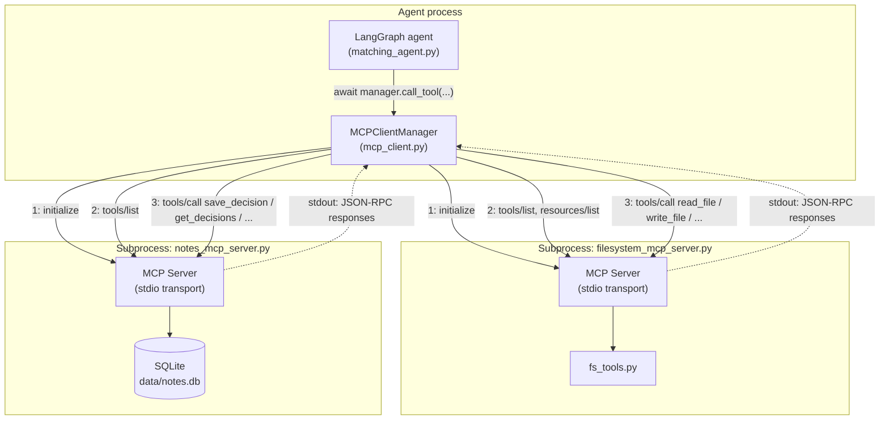
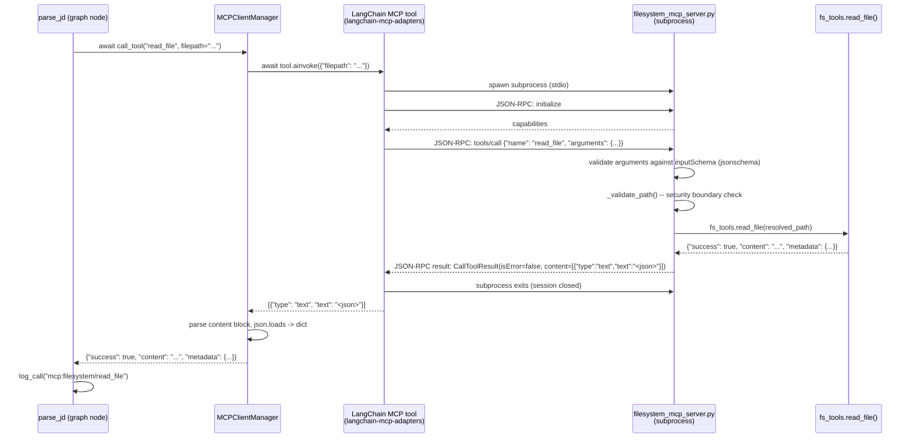

# Milestone 4 — MCP Architecture

How the agent talks to the filesystem and the notes store over the Model
Context Protocol (JSON-RPC 2.0), instead of importing Python functions.

## Agent ↔ MCP interaction

Each server is a separate OS process, launched over stdio (its stdin/stdout
*is* the JSON-RPC transport — see the "subprocess lifecycle" note below).
`MCPClientManager` is the only thing in the agent process that knows these
processes exist; every LangGraph node calls `manager.call_tool(...)` the
same way regardless of which server actually implements the tool.

**Subprocess lifecycle, precisely:** `langchain-mcp-adapters` 0.3.x opens a
fresh stdio subprocess for each `tools/list` call and for each individual
tool invocation, tearing it down when that call returns — verified directly
against the installed package (see `mcp_client.py`'s module docstring).
There is no long-lived server process sitting between calls; "the
filesystem server" is really "a process that gets started, asked one
question, and exited," repeated per call. That's simple to reason about
and impossible to leak, at the cost of a process-startup round trip per
call (a few hundred ms) — acceptable for a demo-scale agent, worth knowing
if this were serving production traffic.

## Sequence: one tool call, end to end

`parse_jd` reading a job-description file via MCP:

A failure (bad path, missing file, schema violation) takes the same shape
but with `isError: true` and a text explanation instead of a `success`
payload — `MCPClientManager.call_tool` normalizes both into
`{"success": False, "error": str}` so graph nodes handle an MCP failure
exactly like they always handled an `fs_tools` failure.

## Every MCP tool

| Tool | Server | Params | Returns |
|---|---|---|---|
| `read_file` | filesystem | `filepath` | `{success, content, metadata}` or isError |
| `list_files` | filesystem | `directory`, `extension?` | `{directory, files: [...], count}` |
| `write_file` | filesystem | `filepath`, `content` | `{success, filepath, bytes_written}` or isError |
| `search_in_file` | filesystem | `filepath`, `keyword` | `{success, matches: [...], match_count}` or isError |
| `watch_directory` | filesystem | `directory`, `timeout_seconds?` | `{watch_id, directory, status, timeout_seconds}` |
| `get_watch_events` | filesystem | `watch_id` | `{watch_id, events: [...], active}` |
| `batch_process` | filesystem | `filepaths: [...]`, `operation: "read"\|"extract_metadata"` | `{results: [...], succeeded, failed, total_elapsed_seconds, serial_elapsed_estimate_seconds, concurrency}` |
| `save_decision` | notes | `candidate_name`, `job_role`, `decision: "hire"\|"no_hire"\|"maybe"`, `rationale` | `{success, id, ...created_at}` or isError |
| `get_decisions` | notes | `job_role?` | `{job_role_filter, decisions: [...], count}` |
| `get_candidate_history` | notes | `candidate_name` | `{candidate_name, previously_screened, decisions: [...], count}` |

## Resources

Only `filesystem_mcp_server.py` exposes resources — the resume corpus.

| URI scheme | What it names | Enumerated by | Read by | Notified by |
|---|---|---|---|---|
| `file://<absolute path>` | One resume file inside `resume_directory` | `resources/list` | `resources/read` | `notifications/resources/list_changed` (add/remove), `notifications/resources/updated` (edit of a subscribed uri) |

## Tools vs. resources

These are two different MCP request families, deliberately kept separate
in the server (see `filesystem_mcp_server.py`'s module docstring for the
full rationale):

- **Tools** are *actions the model invokes*, with arguments it chooses:
  read this specific file, search for a keyword, start watching a
  directory. `tools/list` returns names + JSON-Schema argument shapes;
  `tools/call` executes one.
- **Resources** are *data a client enumerates and reads*, independent of
  any model decision — here, the 100-file resume corpus. A UI or another
  agent can walk `resources/list`, `resources/read` each `file://` URI, and
  `resources/subscribe` to be told when one changes, without an LLM turn
  ever happening.

They matter for different consumers: an LLM decides *when* to call a tool;
a client (or a human inspecting the corpus) decides *which* resources it
wants, on its own schedule.

**A documented SDK caveat:** `mcp==1.29.1`'s low-level `Server` hardcodes
`resources.subscribe: false` in the capabilities it reports during
`initialize`, even though `filesystem_mcp_server.py` registers a working
`subscribe_resource` handler. This was verified directly (see
`test_mcp_scenarios.py` / the manual notification smoke test during
development): calling `resources/subscribe` works and both notification
types fire correctly, the capability flag is simply wrong. A
capability-gated client that checks `capabilities.resources.subscribe`
before calling would incorrectly skip it; a client that just calls it (as
this project's tests do) is unaffected.

## Error handling: two tiers, by design of the SDK

- **Tool execution errors** (`tools/call`): the SDK's `call_tool` wrapper
  catches every exception a tool handler raises — including the
  path-traversal check failing, a missing file, a file over
  `max_file_size_bytes`, or its own JSON-Schema validation against the
  tool's `inputSchema` — and converts it into a *successful* JSON-RPC
  response whose `CallToolResult.isError` is `true`, carrying a
  descriptive message. This is intentional per the MCP spec: tool
  failures belong in the result so the calling model can see them and
  self-correct, not in the protocol envelope.
- **Resource errors** (`resources/read`): not wrapped that way — raising
  `McpError(ErrorData(code=INVALID_PARAMS, ...))` there propagates all the
  way out as a genuine top-level JSON-RPC error response
  (`{"error": {"code": -32602, ...}}`). Used for bad or out-of-bounds
  resource URIs.

`test_mcp_scenarios.py` tests 5 and 6 exercise both paths directly and
assert on the actual shape each one takes.

## Configuration and the security boundary

`mcp_config.json` (env-var overridable, see the README) is read and
validated at server startup — a malformed or missing required field exits
immediately with a clear message rather than starting in a broken state.

`allowed_directories` is the security boundary. Every filepath or directory
argument any filesystem tool receives is resolved with `os.path.realpath`
(collapsing `../` sequences and symlinks) and checked to be a descendant of
one of the configured allowed directories *before any I/O happens*
(`_validate_path` in `filesystem_mcp_server.py`). An absolute path outside
the sandbox (`/etc/passwd`) or a relative escape
(`../../../etc/passwd`) both resolve to the same real path and get rejected
the same way. This is what the original `fs_tools.py` never had: called
directly, it passed whatever path an agent (or a bug, or a prompt
injection) handed it straight to `open()`.

## Before / after

| | Before (Milestone 1-3) | After (Milestone 4) |
|---|---|---|
| Agent's access to the filesystem | `import fs_tools`; direct function calls | `mcp_client.MCPClientManager`; JSON-RPC over stdio to a subprocess |
| Path safety | None — whatever path arrived was opened as-is | Every path resolved and checked against `allowed_directories` before I/O |
| Tool discovery | Hardcoded imports (`from agent_tools import read_file, ...`) | `tools/list` at startup; the agent never hardcodes what's available |
| Process boundary | None — one Python process, one failure domain | Filesystem and notes logic run in their own subprocesses; a crash or hang there doesn't take down the agent process |
| Adding a new tool implementation language | Must be Python, in-process | Any MCP-compliant server in any language — the agent only sees `tools/list` |
| Reusability | Tools are Python functions importable only by this codebase | Both servers are standalone MCP servers any MCP client (Claude Desktop, another agent, the MCP inspector) can talk to |
| Cross-session memory | None | `notes_mcp_server.py` persists screening decisions to SQLite, queryable across process restarts |
| Concurrent file processing | Serial only | `batch_process` — bounded concurrent processing with per-file partial-failure handling |
| Filesystem change awareness | None | `watch_directory`/`get_watch_events` (poll-based, for the agent) and `resources/list_changed` / `resources/updated` (push, for any subscribed MCP client) |

What this buys, concretely: process isolation (a bug in PDF parsing can't
crash the LangGraph process), language independence (a future tool server
doesn't have to be Python), runtime discovery (the agent adapts to
whatever tools a server offers without a code change), and reusability
(the same two servers are usable from any MCP client, not just this
agent). The cost is real: a JSON-RPC round trip (and, in this SDK version,
a subprocess spawn) per call, versus a direct function call. For a
demo-scale screening agent that's a fair trade; for a latency-sensitive
production path it's the first thing to profile.
