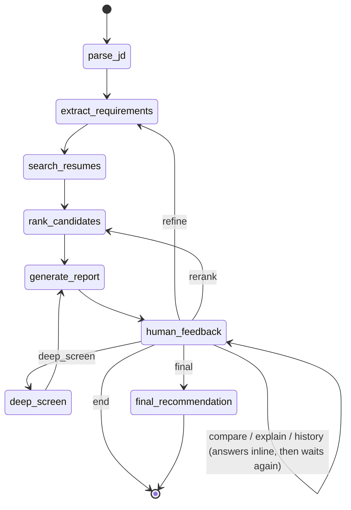

# Matching Agent — State Machine

## Graph diagram

The compiled graph pauses (`interrupt_before=["human_feedback"]`) every time
control is about to enter `human_feedback`. A caller (`app.py` / `cli.py`)
injects the user's next message into state and resumes, so `human_feedback`
always classifies the *latest* message rather than the one that started the
turn.

The `compare`, `explain`, and `history` routes are answered directly inside
`human_feedback` (there's no dedicated downstream node for them) and loop
back to `human_feedback`, which re-triggers the interrupt and leaves the
agent waiting for the next message — instead of ending the conversation.
`history` (Milestone 4) queries the notes MCP server for a candidate's past
screening decisions, independent of the current shortlist.

Since Milestone 4, `parse_jd`, `human_feedback`, and `final_recommendation`
are `async def` nodes (they call the MCP client); the graph is driven via
LangGraph's async API throughout (`astream`/`aget_state`/`aupdate_state` in
`run_turn`) — see [`../docs/mcp_architecture.md`](mcp_architecture.md).

## AgentState fields

| Field | Type | Purpose | Written by |
|---|---|---|---|
| `messages` | `Annotated[list, add_messages]` | Full conversation history (LangGraph-managed append). | Every node that produces user-facing output: `generate_report`, `rank_candidates` (delta narrative), `deep_screen`, `final_recommendation`, `human_feedback` (compare/explain answers). |
| `job_description` | `str` | The raw job description text currently in scope. | `parse_jd` |
| `requirements` | `dict` | `{"role_title", "must_have": {"skills", "min_years"}, "nice_to_have": {"skills"}}` | `extract_requirements` (initial extraction and "refine" updates) |
| `candidates` | `list[dict]` | Full retrieved candidate pool with scores, pre-must-have-filter. | `search_resumes` |
| `shortlist` | `list[dict]` | Current ranked, filtered shortlist (top 10). | `rank_candidates` |
| `round_number` | `int` | 1 = initial screen, 2 = deep analysis, 3 = final recommendation. | `deep_screen` (sets 2), `final_recommendation` (sets 3) |
| `reports` | `dict[str, str]` | `candidate_name -> report text`, accumulated across rounds. | `generate_report`, `deep_screen`, `final_recommendation` |
| `user_feedback` | `str` | The latest user refinement instruction (summarized). | `human_feedback` |
| `next_action` | `str` | Routing hint: `refine \| rerank \| deep_screen \| final \| compare \| explain \| history \| end`. | `human_feedback` |

## Nodes

| Node | What it does | Tools called | State mutated |
|---|---|---|---|
| `parse_jd` | Resolves the job description from the latest message — either a filepath referenced in the text (read via the `read_file` MCP tool, `mcp:filesystem/read_file`) or raw JD text (with a leading instruction like "Find me candidates for this job description:" stripped). | `mcp:filesystem/read_file` | `job_description` |
| `extract_requirements` | Calls the `extract_requirements` tool to get structured must-have/nice-to-have requirements. On a "refine" turn, folds the user's instruction and the previous requirements into the prompt so the update is additive rather than a re-derivation from scratch. | `extract_requirements` | `requirements` |
| `search_resumes` | Calls the `rag_search` tool (wrapping `JobMatcher.search`) to retrieve the candidate pool. | `rag_search` | `candidates` |
| `rank_candidates` | Applies must-have filtering (min years, required skills) and takes the top 10. If re-ranking an existing shortlist, also emits an AIMessage narrating what changed (moved up/down, dropped, added). | — | `shortlist`, `messages` (delta narrative, refine/rerank turns only) |
| `generate_report` | Produces a round-1-style match report per shortlisted candidate: score breakdown, strengths, gaps, and improvement suggestions for borderline candidates. | — | `reports`, `messages` |
| `human_feedback` | Classifies the latest user message into a routing action via a forced tool call to the configured LLM (OpenRouter). For `compare`/`explain`, also builds the answer inline (grounded in the current shortlist); for `history`, queries `mcp:notes/get_candidate_history` — none of the three has a dedicated downstream node. | `compare_candidates` (for `compare`), `mcp:notes/get_candidate_history` (for `history`) | `next_action`, `user_feedback`, `messages` (compare/explain/history answers only) |
| `deep_screen` | Round 2: for each shortlisted candidate, generates interview questions and pulls their top retrieved excerpts. | `generate_interview_questions` | `reports`, `round_number` (set to 2), `messages` |
| `final_recommendation` | Round 3: hire / no-hire / maybe verdict per candidate with justification grounded in score and matched skills. Persists each verdict via the notes MCP server. | `mcp:notes/save_decision` (per candidate) | `reports`, `round_number` (set to 3), `messages` |
